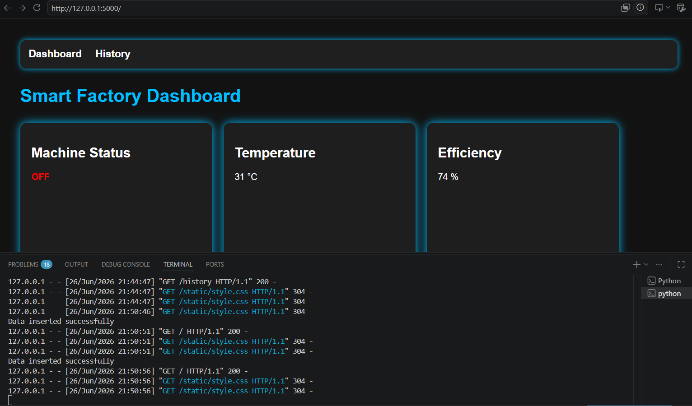
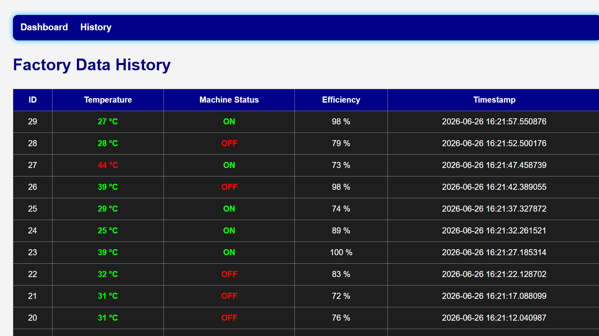
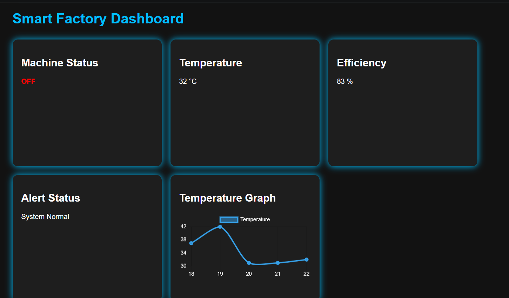
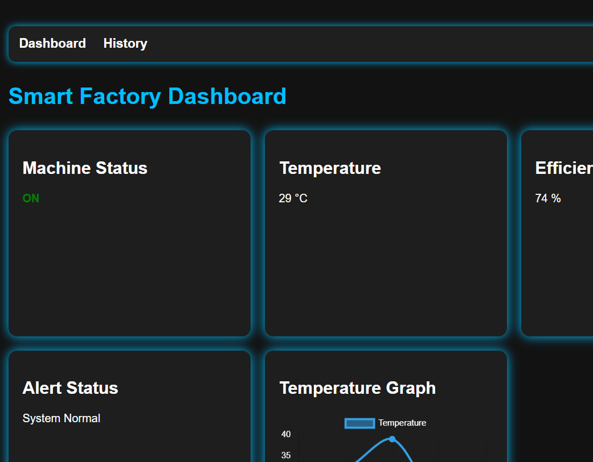

# Smart Factory Dashboard

A Flask-based IoT Smart Factory Monitoring Dashboard with real-time machine monitoring, temperature tracking, efficiency analysis, and historical data storage.

## Features

* Real-time factory dashboard
* Temperature monitoring
* Machine ON/OFF status
* Efficiency tracking
* Alert system for high temperature
* Historical data storage using SQLite
* Temperature graph using Chart.js
* REST API endpoint
* Dark modern UI

## Technologies Used

* Python
* Flask
* SQLite
* SQLAlchemy
* HTML
* CSS
* JavaScript
* Chart.js

## Project Structure

smart-factory-dashboard/
│
├── app.py
├── factory.db
├── templates/
│   ├── index.html
│   └── history.html
│
├── static/
│   └── style.css

## Installation

1. Clone the repository

git clone https://github.com/byme9876/smart-factory-dashboard.git

2. Open project folder

cd smart-factory-dashboard

3. Install dependencies

pip install flask flask_sqlalchemy

4. Run the application

python app.py

5. Open browser

http://127.0.0.1:5000

## Dashboard Screenshots

### Main Dashboard

### History Page

### Home Screen 1

### Home Screen 2

## API Endpoint

/api/data

Returns latest factory data in JSON format.

## Future Improvements

* ESP32 sensor integration
* MQTT communication
* Cloud deployment
* User authentication
* Email alerts
* Live chart updates

